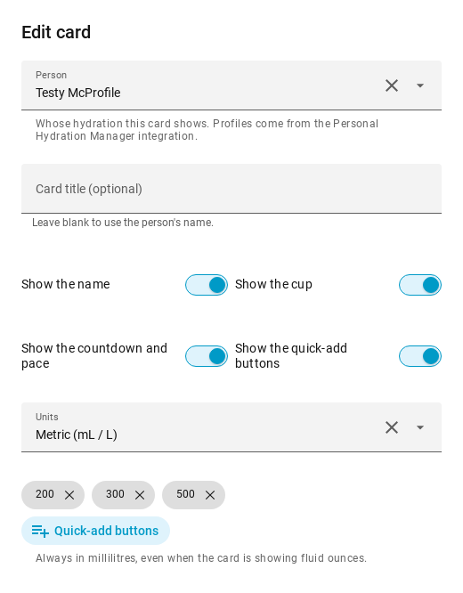
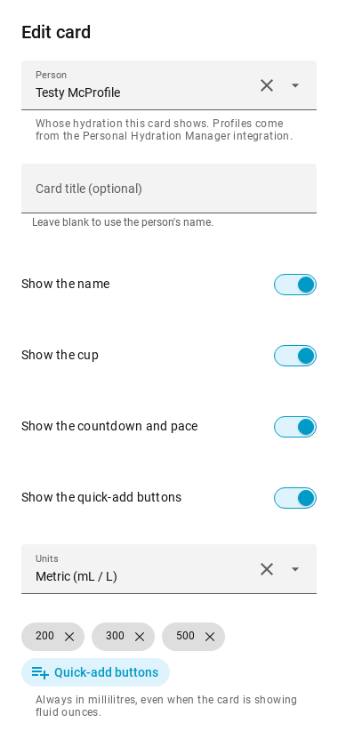

# Spec — Card editor on `ha-form`

*Status: approved 2026-08-23.*

## Problem

The card's visual editor is 110 lines of hand-built DOM producing **seven browser-default
controls**: a `<select>` for the profile, four `<input type="checkbox">`, a second `<select>`
for units, and a text `<input>` for the quick-add volumes. It renders inside Home Assistant's
own card-configuration dialog, surrounded by HA Material fields, and looks like none of them —
different font metrics, different focus rings, different spacing, and it follows the browser's
`color-scheme` rather than the active Home Assistant theme.

The `standards/ux.md` rule it breaks is **consistency** — *"reuse the app's existing primitives
before inventing new ones; a new control matches the treatment of its neighbours."*

*A correction to the premise this work started from.* The sibling port was driven partly by a
**copy** violation — Laundry Weather's sensor `<select>` listed raw entity IDs. That does **not**
apply here: this card's `_profileOptions()` already labelled each option with
`friendly_name.replace(" Daily target", "")`, so the dropdown already read "Testy McProfile".
The only raw identifier it could show was the `|| slug` fallback when an entity has no friendly
name. Worth stating plainly, because the copy argument is the weaker one for this card and the
two below are the real reasons.

There is also a structural fault, and it matters more than the cosmetic one. `set hass` calls
`_render()`, which assigns `shadowRoot.innerHTML` unconditionally. Home Assistant assigns `hass`
several times a second, so **any control the user has open is destroyed underneath them**. The
sibling Laundry Weather card had exactly this bug — its clock-format dropdown flashed open and
shut — and fixed it in v0.3.1 with an equality check before re-rendering. That fix is a *guard*,
and a later edit to `_render()` can undo it.

`ha-form` removes the possibility rather than guarding it: the form element is created once and
thereafter only `.hass`, `.schema` and `.data` are assigned, so Lit patches in place and there is
no `innerHTML` to blow away.

## Scope

The **card** editor only — `personal-hydration-card-editor` inside
`custom_components/personal_hydration_manager/www/personal-hydration-card.js`. The card's own
rendering path is untouched by this change.

Not the integration's configuration screen — that is a Python config/options flow rendered by
Home Assistant itself, and it already uses `EntitySelector`, `NumberSelector`, `SelectSelector`
and `TimeSelector`.

Not the card's `+ Custom…` button, which opens a `window.prompt()`. That is the same
raw-primitive problem on the card rather than the editor, and it is handled separately.

## Constraints found before designing

**This is not a new pattern for this fleet.** `HA-Laundry-Weather` v0.4.0 and `ha-jokes` are the
in-house references: a labels map, a helpers map, one `ha-form`, and a `value-changed` listener
that stops the inner event and re-emits `config-changed`.

**The stored `profile` is a slug, not an entity ID.** This is the one place this card differs
materially from Laundry Weather. The config holds `profile: "loryan"`, from which the card
string-builds five entity IDs (`sensor.phm_loryan_daily_target` and friends). The dropdown's
option values are those slugs directly, so the stored shape is untouched and no dashboard needs
migrating.

Reading the profile list back out of `entity_id` is exactly as robust as the card already is:
`sensor.py:85` pins `entity_id` to `sensor.phm_{slug}_{key}` and the card's whole read path
depends on that convention. This adds no new fragility. Labels come from `friendly_name` with
the trailing " Daily target" stripped, falling back to the entity ID if it has been renamed.

**An entity picker was the original intent, and the preview ruled it out.** `include_entities`
would have offered exactly the old candidate set with search and icons, so it was built and
rendered first. Home Assistant's entity picker leads with the *entity's* own name and puts the
device underneath, so every row read **"Daily target"** with the person's name in smaller text
below — the opposite emphasis from the one that matters, in the field the whole change is about.
Both options were rendered in real Home Assistant and compared before choosing.

A named dropdown wins here because the thing being chosen is a person from the household, not an
arbitrary entity. It is not a return to the fault being fixed: the objection to the old
`<select>` was that it listed *raw identifiers*, and a list of people's names is not that. It
also removes a whole class of bug — the option values *are* the stored slugs, so nothing is
translated on the way in or out. The cost is the loss of a search box, which starts to matter
somewhere past about eight profiles.

**`ha-form` is only defined once Home Assistant has loaded its editor chunk.** Mushroom's
`loadHaComponents()` — calling `hui-tile-card.getConfigElement()` to force it — is the
community-canonical belt-and-braces.

**`customElements.whenDefined()` must not be called at module top level.** Home Assistant
replaces `window.customElements` with a scoped-registry polyfill while its core bundle boots, so
a top-level binding attaches to the native registry's method and may never fire.

**`quick_add` is stored in millilitres regardless of the display unit.** The card converts for
display, so in fl oz mode a stored `200` renders as a "+ 6.8 fl oz" button. Nothing in the
current editor says so. This is a live copy trap, not a new one.

**The editor's `setConfig` does not apply the card's defaults, but the card's does.** A config
omitting `show_cup` therefore shows the box unchecked while the card renders the cup — the
editor currently contradicts what the user can see.

## Flow

Unchanged for the user: *Edit card* → the same settings → changes apply live. What changes is
that the fields are Home Assistant's own, the profile is chosen by person's name rather than by
entity ID, the quick-add volumes are chips instead of a comma-separated string, and the dropdowns
open in an overlay layer instead of as native browser popups.

## Design

Approved layout: the four view toggles sit in an `ha-form` `type: "grid"`, preserving today's 2×2
block. HA's grid collapses to a single column below its breakpoint, so 380px needs no special
handling.

| field | selector | note |
|---|---|---|
| `profile` | `select`, dropdown | options are `{value: slug, label: person's name}` |
| `title` | `text` | new — the card has a title row with no override |
| `show_title`, `show_cup`, `show_countdown`, `show_manual` | four `boolean` in one `grid` | today's 2×2 block |
| `unit` | `select`, dropdown | Metric (mL / L) · Imperial (fl oz) |
| `quick_add` | `select`, `multiple` + `custom_value` | chips; presets 150·200·250·300·330·500·750·1000, bare numbers, any value typeable |

### States

- **Empty** — with no profiles configured the dropdown has no options and says nothing useful
  about why. The profile helper is replaced in that case with *"No hydration profiles yet — add
  one under Settings → Devices & Services → Personal Hydration Manager."*
- **Loading** — `_render()` returns until `hass` arrives. In the real dialog `hass` is present on
  the first assignment.
- **Error / stale profile** — a stored slug matching no option leaves the dropdown blank, and
  editing *any other field* would read that blank as the user clearing the profile. The editor
  restores the stored slug, but **only when it is genuinely absent from the list** — clearing a
  profile that *is* in the list is honoured, so the field stays clearable.
- **380px** — verified by screenshot, not assumed.
- **Status** — no colour-only state anywhere in the editor.
- **Mobile parity** — no separate work. Home Assistant cards render in the companion app through
  the same frontend, so the 380px screenshot *is* the mobile check.

## Acceptance criteria

1. Every control is a Home Assistant component; **no raw `<select>` or `<input>` survives** in the
   editor.
2. The profile control offers exactly the profiles the old `_profileOptions()` filter produced —
   one per `sensor.phm_*_daily_target` sensor — labelled with the person's name and nothing else.
3. Every stored config key round-trips unchanged. `profile` remains a slug; a config written by
   the old editor loads and re-saves byte-identically, and no dashboard needs an edit.
4. Editing a field other than the profile never clears a profile whose entity is missing.
5. `quick_add` round-trips as an array of positive integers, in millilitres, and its helper text
   says so explicitly.
6. The `ha-form` element is the **same node object across 20 consecutive `hass` assignments**, and
   the editor still updates when the config genuinely changes.
7. The profile control renders with non-zero height.
8. Screenshots at desktop and ~380px show the editor matching the surrounding HA fields.

## Non-goals

- The card's rendering path. Only the editor changes.
- The integration's config/options flow.
- Migrating stored configs. Nothing about the stored shape changes, so there is nothing to
  migrate.
- The `window.prompt()` behind `+ Custom…` — handled separately.

## What shipped





Verified by `scripts/verify-card-editor.mjs`, which drives a real Home Assistant in Chromium and
asserts all of the above — 11/11. Run it against `HomeAssistant-DEV` with:

```
ssh blaster "sudo -n docker run --rm --network container:HomeAssistant-DEV \
  -v /tmp/phm-verify:/work -v /tmp/phm-verify/out:/out -w /work -e HA_TOKEN=... \
  mcr.microsoft.com/playwright:v1.48.0-jammy bash -lc 'node verify-card-editor.mjs'"
```
