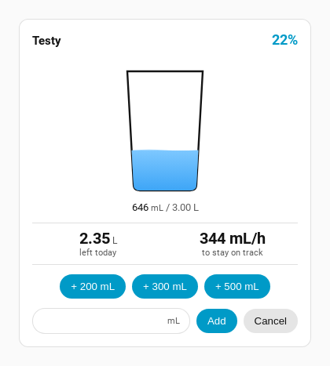
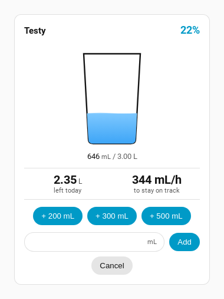

# Spec — The custom amount is entered on the card

*Status: approved 2026-08-23.*

## Problem

Tapping **+ Custom…** called `window.prompt()`. That is browser chrome, not Home Assistant: it
ignores the theme, cannot be styled, and on a phone it is a system modal thrown over the whole
screen to type one number. It is the same raw-primitive fault as the editor's `<select>`, on the
card rather than in the dialog.

It also cannot report a problem. `parseFloat` failures and non-positive numbers were both
`return`ed silently, so a mistyped amount looked exactly like a successful one.

## Constraint that shapes the design

`_render()` replaces the card's entire shadow subtree. Home Assistant assigns `hass` several
times a second and a 30-second tick timer calls `_render()` as well. **An input living in that
subtree is destroyed by any of them**, mid-typing, with the caret in it. Whatever replaces the
prompt has to survive that.

## Flow

*+ Custom…* → the button is replaced in place by a number field with **Add** and **Cancel**
beside it, focused, ready to type. Enter adds; Escape or Cancel closes and adds nothing.

## Design

The field and both buttons match the card's own pill treatment rather than Home Assistant's
Material fields — the neighbours here are the card's quick-add pills, and `standards/ux.md` asks
a new control to match the treatment of *its* neighbours.

- Numeric input, `inputmode="decimal"`, spinners suppressed, with the current unit shown beside
  it as a word ("mL" / "fl oz") and carried on the field's `aria-label`.
- **Add** uses the primary pill; **Cancel** the secondary. Both are real text, not glyphs.
- While the field is open, `_render()` is held off and the pending render is replayed on close.
  The figures freeze for the few seconds it is open — a better trade than the field vanishing
  under the user's hands.
- **Focus is deferred one frame.** The button that opened the field is removed by the same
  render, and the browser resets focus to `<body>` as that click finishes, undoing a synchronous
  `focus()`. Without the deferral the field opens unfocused and has to be tapped twice.

### States

- **Error** — a non-number or anything ≤ 0 keeps the field open, marks it `aria-invalid`, and
  shows *"Enter a number bigger than zero."* in a `role="alert"` line. Nothing is logged.
- **380px** — the field and **Add** share a row and **Cancel** wraps beneath; the field keeps a
  120px minimum so it never collapses. No horizontal scroll.
- **Status** — no colour-only state; the error is words, and the invalid field is marked in the
  accessibility tree rather than only by colour.
- **Mobile parity** — none needed; HA cards render in the companion app through the same
  frontend, so the 380px screenshot is the mobile check.

## Acceptance criteria

1. `window.prompt`, `alert` and `confirm` appear nowhere in the card.
2. The field appears only after **+ Custom…** is pressed, and arrives focused.
3. The open field survives 20 consecutive `hass` assignments **and** a direct `_render()`, as the
   same node, keeping what has been typed.
4. Escape closes it and logs nothing.
5. A bad amount shows a message, keeps the field open, and logs nothing.
6. Enter confirms, closes, and logs the amount in millilitres.
7. In fl oz mode the entered value is converted before logging (10 fl oz → 295.735 mL).

## Non-goals

- The editor. Handled in [card-editor-ha-form.md](card-editor-ha-form.md).
- The quick-add pills themselves, which already work.
- The card's mixed-unit captions ("646 mL / 3.00 L"), which are pre-existing and unrelated.

## What shipped

Verified by `scripts/verify-custom-add.mjs` against real Home Assistant — 9/9, service calls
intercepted so the run logs nothing for real.
