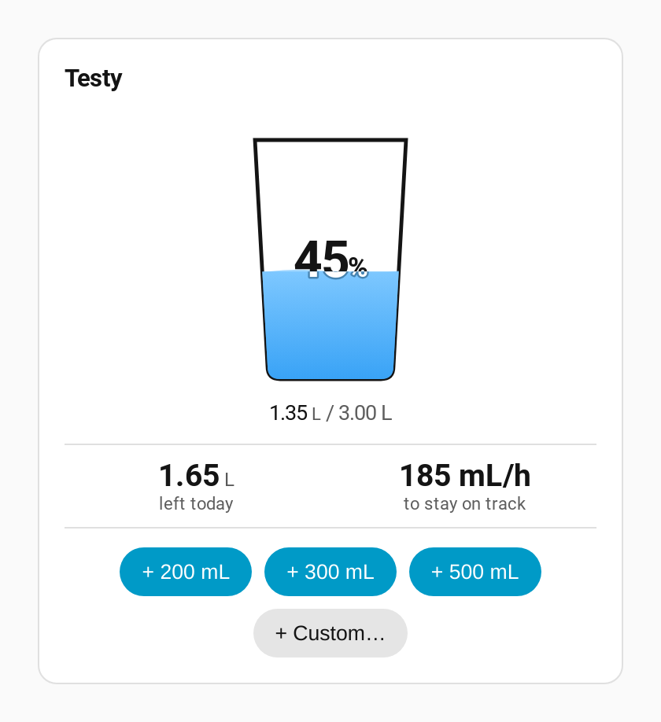
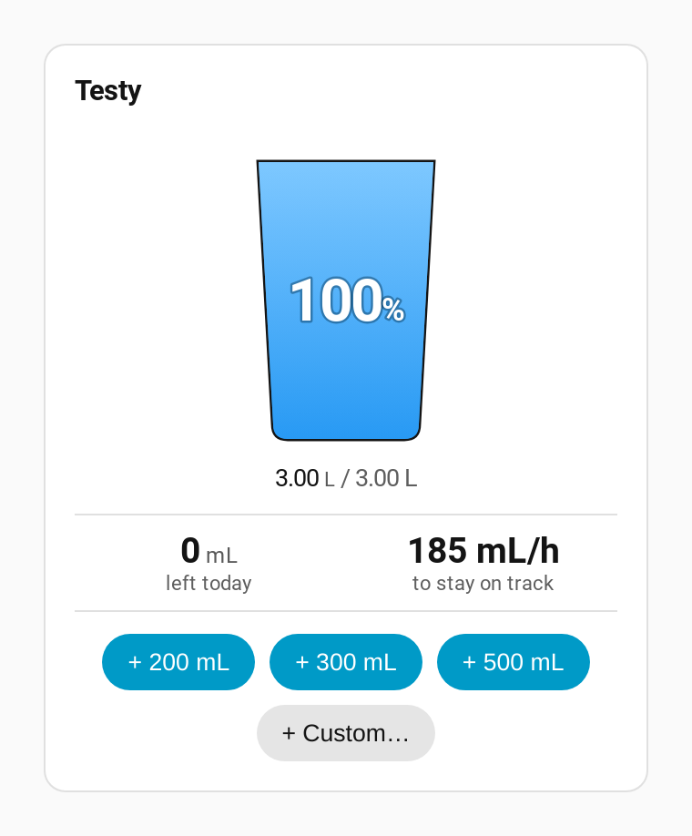

# Spec — The percentage is displayed inside the cup

*Status: approved 2026-08-31.*

## Problem

The progress percentage sits in a header row at the top of the card — `Loryan · · · 42%` when the
name is shown, or a right-aligned `42%` on a row of its own when it isn't. That row costs vertical
space on a card that is already tall, and it puts the number somewhere other than the thing it
describes: the cup right below it is a percentage gauge with no percentage on it.

Moving the number into the cup saves the row and reads more directly.

## Constraint that shapes the design

**The number's background moves.** Above the waterline it sits on the card background — which is
near-white in a light theme and near-black in a dark one. Below the waterline it sits on the water
gradient, `#7ec8ff` at the surface down to `#2196f3` at the base. And the waterline travels
through the digits as the day goes on.

No single fill colour works. Theme text colour is invisible against the water in a light theme;
white is invisible against the card in a light theme and measures only ~1.8:1 against the pale
`#7ec8ff` right at the waterline, which is exactly where the number sits at mid-fill.

The cup is also **narrow**: `viewBox="0 0 200 220"` rendered at 160×180px, with an interior width
of roughly 100 viewBox units (~80 real px) at mid-height. `100%` is the widest string the card can
ever show and is the case that sets the font size.

## Design

The number is drawn **twice**, at identical coordinates, each copy clipped to one side of the
waterline:

```html
<clipPath id="dryClip"><rect x="0" y="0"        width="200" height="${fillY}"/></clipPath>
<clipPath id="wetClip"><rect x="0" y="${fillY}" width="200" height="${220 - fillY}"/></clipPath>
...
<text x="100" y="129" class="hyd-pct dry" clip-path="url(#dryClip)">42%</text>
<text x="100" y="129" class="hyd-pct wet" clip-path="url(#wetClip)">42%</text>
```

- **`dry`** takes `var(--primary-text-color)`, so it follows light and dark themes for free.
- **`wet`** is theme-independent, because its background is the water and the water is the same
  blue in every theme. It is **white with a translucent dark halo**
  (`paint-order: stroke; stroke: rgba(0,42,71,.42)`), chosen from rendered mockups over the
  alternative of deep navy.

  The halo is load-bearing, not decoration. Bare white measures only **1.81:1** against the pale
  `#7ec8ff` at the water's surface — which is exactly where the number sits at mid-fill. Composited
  over the water, the halo gives the glyph a **3.94:1** boundary at the surface and **5.77:1** at
  the base, so the number is outlined at every water shade.

  Navy was the runner-up: calmer in a light theme, but it flips visibly against the near-white dry
  copy in a dark theme, and softens against the deep blue at the bottom of a full cup. White plus
  halo is seamless in dark mode, where both halves are near-white.

The split lands exactly on the waterline, so a digit can be half one colour and half the other.
That is the effect a liquid-fill gauge is expected to have, not an artefact.

Both clip-path ids are safe to hard-code: every card renders in its own shadow root.

### What moves and what doesn't

- **Only the percentage moves.** The `646 mL / 3.00 L` caption stays beneath the cup.
- The name row is unchanged when `show_title` is on; it simply no longer carries a number.
- The standalone right-aligned percentage row (`show_title: false`) is **deleted** — that is the
  row the change buys back.

### States

- **0%** — the number sits entirely on the empty cup, in theme text colour.
- **Mid-fill** — the waterline runs through the digits and the number is two-toned.
- **100%** — the number sits entirely on water; the widest string against the narrowest part of
  the cup it must fit.
- **Cup switched off** (`show_cup: false`) — there is nowhere to put the number, so it **falls
  back to the header** exactly as it renders today. Turning the cup off must never silently cost
  someone their percentage.
- **380px** — the cup is a fixed 160px so nothing reflows; the check is that `100%` does not
  collide with the cup walls and the card gains no horizontal scroll.
- **Errors** — the "pick a profile" and "no hydration profile found" cards are untouched.
- **Status without colour** — the percentage is a number, never a colour-coded state. The two text
  colours are a legibility device, not a signal; nothing is encoded in which one you see, so the
  colour-blindness rule is satisfied by construction.
- **Mobile parity** — none needed. Home Assistant cards render in the companion app through the
  same frontend, so the 380px screenshot *is* the mobile check.

### Accessibility

The cup SVG is `aria-hidden="true"` today, which is correct only while the number is real text
somewhere else. Once the number moves inside, the SVG takes `role="img"` and an `aria-label`
carrying the figure in words — `"42% of today's target — 646 mL of 3.00 L"`. The percentage must
not leave the accessibility tree just because it left the header.

## Acceptance criteria

1. With `show_cup: true`, no percentage appears in the header; the cup SVG carries it.
2. The number renders as exactly two `<text>` nodes, clipped above and below, splitting at `fillY`.
3. The dry copy clears **4.5:1** against the card background in both themes.
4. The wet copy's halo clears **3:1** against the white glyph over *both* gradient stops, so the
   number is outlined at every water shade. (Bare white does not clear 3:1 at the surface — this
   criterion is the one that would catch the halo being dropped.)
5. `100%` fits inside the cup walls with clearance at 380px — no clipped or overlapping glyphs.
   Measured against the cup's interior width **at the text's own height**, since the walls taper.
6. The cup SVG carries `role="img"` and an `aria-label` naming the percentage; `aria-hidden` is gone.
7. With `show_cup: false`, the percentage returns to the header, in both `show_title` states.
8. With `show_title: false` and the cup on, the card gains no empty row where the header was.
9. Correct in light **and** dark themes.
10. `manifest.json` `version`, `frontend.py`'s cache-buster and `CARD_VERSION` are bumped in
    lockstep. There are **three** of them, not two.

## Non-goals

- The amounts caption. It stays under the cup; folding it inside too was considered and declined.
- A percentage that rides the waterline as a moving level marker. Considered and declined.
- A new editor toggle. The percentage lives in the cup whenever the cup is shown.
- The cup's own geometry, gradient and wave animation, which are unchanged.
- The countdown, pace and quick-add rows, which are untouched.

## What shipped





Verified by `scripts/verify-percent-in-cup.mjs` against real Home Assistant on
`HomeAssistant-DEV` — **15/15**, service calls proxied away so a run logs nothing for real. The
measurements it reports rather than assumes:

| Check | Measured |
|---|---|
| Clip split vs. waterline | exact at 0, 20, 32, 35, 45, 50, 70, 100% |
| `100%` width | 80.8u inside 103.8u of cup interior — **23.0u clear** |
| Dry copy, light theme | `rgb(20,20,20)` on white — **18.42:1** |
| Dry copy, dark theme | `rgb(225,225,225)` on `rgb(28,28,30)` — **13.01:1** |
| Halo at the water's surface | **3.94:1** (bare white would be 1.81:1) |
| Halo at the cup's base | **5.77:1** (bare white would be 3.12:1) |

The design choice itself was made from `scripts/mock-percent-in-cup.mjs`, which rendered the real
card file with only `_renderCup()` patched, across both candidate treatments × five fill levels ×
both themes. (That script no longer patches anything — see the note below.)

One thing the mockups settled that the maths had not: **the two-tone state is rare.** The digits
span y≈101–129, so the waterline only crosses them over a narrow band of fill levels. Everywhere
else the number is a single colour.

> **Updated in 0.3.1.** The waterline was `180 − pct × 1.6`, which put the two-tone band at ~32–50%
> — but it also meant 0% drew water thirty units above the cup's floor, so an untouched target
> looked one-sixth full. The fill now runs from the floor: `210 − pct × 1.9`, and **the band moved
> to ~43–58%**. See [empty-cup-looks-empty.md](empty-cup-looks-empty.md).
